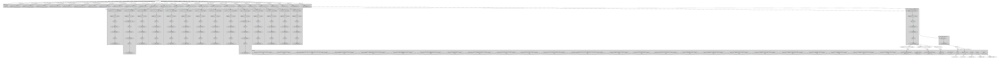

# Envoy-viz

`enovy-viz` visualizes envoy configurations.

## Examples:

### Static Config:

Basic example config from [envoy's docs](https://www.envoyproxy.io/docs/envoy/latest/configuration/overview/examples#static)

### Original destination cluster
Basic example config from [envoy's codebase](https://github.com/envoyproxy/envoy/tree/main/configs/original-dst-cluster)

### With http filters

### Edge

### Advanced Example
Usings lots of envoy's features

### Istio Config Dump Example
Using an istio config dump
